# Assignment 2 - Trajectory Optimization for a Simple Quadruped

**Hand-in:** April 16, 2025, 18:00 CEST

**Important:**
Before you submit your final commit, please make sure:
1. Your code runs without any errors
2. Leave your name, student ID, ETH email address and URL link to demo video in the `my-info.json` file.

# Announcement
 - April 9: Dear student, we find a minor typo in the README.md. The equation of kinematic constraints in Exercise 4 should include the absolute value operator, shown as below.

    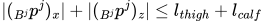


Please merge the changes to your branch by
```bash
# in project directory
$ git remote add origin-start-code https://github.com/CMM-25/a2.git
$ git pull origin-start-code main --rebase
```
and fix conflicts if there's any.


# 1. Introduction

In this assignment, we will implement a trajectory optimization algorithm for a simple quadruped robot. 
The robot has 8 degrees of freedom (DOF), including 4 legs with 2 DOF each (only thigh and knee joints, no hip / abduction joint).

The goal is to transfer various hand-designed / heuristic / kinematic trajectories into optimized trajectories that satisfy the simplified dynamics model with constraints.

For example of a backflip motion:

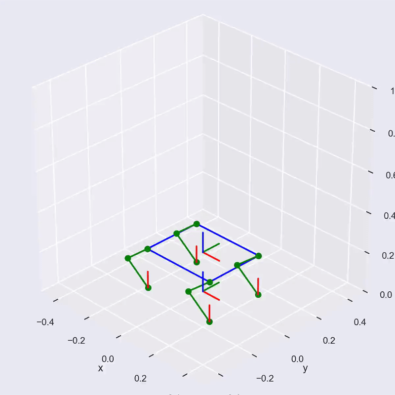

_Kinematic reference trajectory for a backflip motion_


_Optimized trajectory for a backflip motion_

Then we will evaluate the optimized trajectories in a physics simulation environment to see whether our optimized trajectories can be executed with physics.

We will be using [`CasADi`](https://web.casadi.org/) for formulating the trajectory optimization problem and [`MuJoCo`](https://mujoco.readthedocs.io/en/stable/overview.html) for evaluating the optimized trajectories in a physics simulation environment.

The trajectory optimization problem is formulated as a non-linear optimization problem with Single Rigid Body (SRB) dynamics model. We encourage you to read the papers in the reference for your understanding. 
We will also guide you through the setup in the detailed instructions below.
The basic idea is to think of the robot as a single rigid body with 6 DOF and ignore all the dynamic effect that is generated from the limbs (which means the limbs are much lighter than the base and can be considered as massless).

# 2. Hand-in
This assignment consists of two parts: trajectory optimization and evaluation.
In the trajectory optimization part, you will implement the core optimization algorithm to generate optimized trajectories for various motions given full or partial kinematic reference trajectories.
In the evaluation part, you will be implementing various joint-level controllers to track the optimized trajectories in a physics simulation environment and analyze the behavior.

Trajectory optimization (70%, baseline):
 - Ex.1 Achieve a **squatting** motion given kinematic reference trajectory (20%)
 - Ex.2 Achieve a **trotting** motion given kinematic reference trajectory (5%)
 - Ex.3 Achieve a **walking** motion with partial kinematic reference (10%)
 - Ex.4 Achieve a **jumping** motion with given kinematic reference trajectory (5%)
 - Ex.5 Achieve a **bounding** motion given kinematic reference trajectory (5%)
 - Ex.6 Achieve a **180-backflip** motion with partial kinematic reference (10%)
 - Ex.7 Achieve a **360-backflip** motion from scratch (15%)

Evaluation in physics (30%, advanced):
 - Ex.8 Convert the optimized trajectories into desired joint quantities and play back the motion in MuJoCo (10%)
 - Ex.9 Implement a simple PD controller to track the optimized trajectories in MuJoCo, and analyze the behavior (5%)
 - Ex.10 Implement a feed-forward torque controller to track the optimized trajectories in MuJoCo, and analyze the behavior (10%)
 - Ex.11 Combine the feed-forward torque controller with a PD controller to track the optimized trajectories in MuJoCo, and analyze the behavior (5%)

Each sub-exercise build upon the previous one, so it is recommended to complete them in order.

To complete the assignment, you should hand in:
1. code pushed to the repository
2. for each exercise, please provide a link to a short video demonstrating the motion in the `my-info.json` file. (**Please upload your video to YouTube or any other openly accessible video host service.**)
3. for exercise 9, 10, 11 in the advanced part (evaluate in physics), please provide a brief analysis of the behavior and put them in the `behavior_analysis.md` file.

**IMPORTANT** If your code doesn't run successfully, you will get **zero** point from this assignment.

**IMPORTANT** We will be checking the plagiarism of the code. If we find any code that is copied from the internet or other students, you will get **zero** point from this assignment.

# 3. Getting Started

## a. Code structure
The codebase is tested on Ubuntu, MacOS, and Windows.

Main codes:
- `generate_reference.py` contains code producing hard-coded kinematic sketch trajectories. The motion type is specified using the `motion_type` variable.
- `traj_opt.py` contains the core implementation of the trajectory optimization.

Runnable scripts:
- `main.py` contains the main loop for running the optimization, and the `run` function that calls the optimization.
- `evaluation.py` contains the evaluation process for the optimization results in a physical simulation environment using [MuJoCo](https://mujoco.readthedocs.io/en/stable/overview.html).

Helper functions:
- `utils.py` contains various helper functions for coordinate frame transformation, etc.
- `constants.py` contains physical parameters of the robot.
- `draw.py` contains the functions to plot the trajectories and save them as animations.
- `mj_viewer.py` contains the visualization of the robot in the physics simulation environment.
- `export.py` contains the export function to save the trajectories into a `csv` file.

## b. Install dependencies
The animation generation requires `ffmpeg` to be installed on your system. 

For Ubuntu, you can install it by running the following command.
```bash
sudo apt update
sudo apt install ffmpeg
```

For MacOS, you can install it by running the following command.
```bash
brew install ffmpeg
```

For Windows, follow instructions [here](https://phoenixnap.com/kb/ffmpeg-windows) to install `ffmpeg`.

We use `poetry` for managing Python environment, please install `poetry`by following the instructions [here](https://python-poetry.org/docs/#installing-with-the-official-installer).
We recommend installing `poetry` with `pipx` or with the official installer.

After installing, we recommend installing the following plugin to enable support for entering the virtual environment in the terminal.
```bash
poetry self add poetry-plugin-shell
```

We recommend using `python>=3.10, <3.12` for this project. 
<details><summary>**Click** to expand OS-dependent python environment setup instructions.</summary>
---

In **Ubuntu** 22.04, the default Python version is `3.10`, so you can use the default Python version. But for Ubuntu 20.04, you may need to install `python3.10` by running the following command.
```bash
sudo add-apt-repository ppa:deadsnakes/ppa
sudo apt update
sudo apt install python3.10 python3.10-venv python3.10-dev
```

For **MacOS**, you may have various versions of Python installed on your system. We recommend using `pyenv` to manage Python versions ([Docs](https://github.com/pyenv/pyenv)). You can install `pyenv` by following the command:
```bash
brew install pyenv
pyenv install 3.10
```

For **Windows**, you can install `pyenv` by using [this package](https://github.com/pyenv-win/pyenv-win).
Then, install the Python version by running the following command.
```
pyenv install 3.10.0
```
---
</details>

To select the Python version, run the following command.
```bash
pyenv local 3.10
```

To install the dependencies, run the following command in the root directory of the project.
```bash
poetry env use python3.10
poetry lock
poetry install --no-root
```

This will create a virtual environment and install the dependencies in the virtual environment. You may notice a generated file called `poetry.lock` in the root directory of the project. This is the resolved dependency file that `poetry` uses to install the dependencies.

You should configure the python interpreter in your IDE to use the virtual environment created by `poetry`. 
For example:
- In VSCode, you can configure the Python interpreter by following the instructions [here](https://code.visualstudio.com/docs/python/environments).
Select `Python 3.10.0` created by pyenv, i.e., the one with path `.\.venv\Scripts\python.exe` (on Windows).
- In PyCharm, you can configure the Python interpreter by following the instructions [here](https://www.jetbrains.com/help/pycharm/configuring-python-interpreter.html#add-interpreter).

To enter the virtual environment in the terminal, run the following command in the root directory of the project.
```bash
poetry shell
```

To exit the virtual environment, run the following command.
```bash
exit
```

## c. Trajectory Optimization
After entering the virtual environment, you can run `python main.py` the following command to start the optimization process.
- `--display` or `-d` whether to display the animation window
- `--save` or `-s` whether to save the motion as videos
- `--export` or `-e` whether to export the trajectory into csv
- `--name` or `-n` the name of the experiment, if not provided, the name will be the current time

for example:
```bash
python main.py --display --save --export --name <my-experiment-name>
```

Note: this script has two main computational parts: (1) generating and visualize the reference trajectory and (2) running the trajectory optimization and visualize the result.
If you have the `--display` option on, you will have to wait until the reference trajectory visualization to stop, and close the window manually to proceed to the optimization part.

## d. Evaluation in physics
After entering the virtual environment, you can run `python evaluation.py` the following command to start the evaluation process.
- `--file` or `-f` the `csv` file name of the trajectory to be loaded
- `--mode` or `-m` to choose the evaluation mode

There are three evaluation modes: `PLAYBACK`, `TORQUE`, `JOINT_PD`.
- `PLAYBACK`: plays the trajectory in the simulation environment (no physics)
- `FF`: applies the feed-forward torque calculated from the contact forces
- `PD`: applies the PD controller at joint level using optimized joint positions and velocities as the target
- `FF_PD`: applies both the feed-forward torque and PD controller at joint level

for example:
```bash
python evaluation.py --file <my-experiment-name>.csv --mode PLAYBACK
```

# 4. Exercise
Now let's get started with the exercises!

## Exercise 1: Squatting motion (20%)
In this exercise, you will implement the optimization algorithm to achieve a squatting motion given a kinematic reference trajectory.

We represent the state of the robot as $x = (p, R, \dot{p}, \omega) \in \text{R}^{18}$, where $p\in\text{R}^{3}$ represents the position of the base in the world frame, $R\in\text{R}^{3\times 3}$ represents the orientation of the base in the world frame, $\dot{p}\in\text{R}^{3}$ represents the linear velocity of the base in the world frame, and $\omega\in\text{R}^{3}$ represents the angular velocity of the base in the body frame.

The control input of the system is $u = (p^0, p^1, p^2, p^3, f^0, f^1, f^2, f^3) \in \text{R}^{24}$, where $p^j\in \text{R}^{3}$ represents the position of the end-effector of the $j$-th leg in the world frame, and $f^j\in \text{R}^{3}$ represents the contact force of the $j$-th leg in the world frame.
We will iterate the limbs in the order of front-left, front-right, hind-left, hind-right, as shown in `constants.py` (line 6 - 10).

The kinematic trajectory is represented as a sequence of the state and control input pairs,

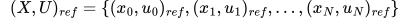

where $N$ is the number of time steps.
The total number of time steps is $N = T / f$, where $T$ is the total time of the motion and $f = 50\ Hz$ is the control frequency.

In `generate_reference.py`, we provide a kinematic reference trajectory for the squatting motion. Please switch the `motion_type` to `squat` and run the script `python main.py --display --name squat` to generate and visualize the reference trajectory.
As you can see, the reference trajectory is a simple squatting motion where the robot squats down and stands up in a sinusoidal manner.
The orientation of the base remains constant during the motion.

All end-effectors are fixed on the ground during the squatting motion, and their positions are hard-coded as `B_p_Bj` in the reference trajectory.
For all the contact force reference, we use a constant value of $mg/4$ for each leg, where $m$ is the mass of the robot and $g$ is the gravity constant.
We set this reference if the end-effector is in contact with the ground (the height for this end-effector is smaller than some threshold $\epsilon$), and set it to zero otherwise.
As you can see, the contact force reference is also very simple and will not reflect the actual dynamics of the system.

Now, your task is to implement the optimization algorithm to achieve the squatting motion given the kinematic reference trajectory.
You can find the optimization problem in `traj_opt.py`.

The optimization problem we will be implementing is a multiple-shooting trajectory optimization problem with the following form, with quadratic cost function.

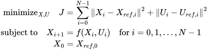

In more detail with the single rigid body, the optimization problem is formulated as follows:

The objective function to minimize consists of the sum of the squared error between the state and control input of the robot and the reference trajectory.

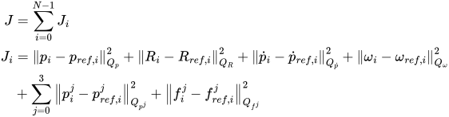

Note: for calculating the orientation cost $J_{R, i}$, you can use the formula $J_{R, i} = (\text{tr}(Q_R - Q_R R_{ref, i}^TR))^2$

The dynamics of the system is given by the following equations:

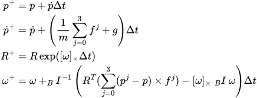

where $[\omega]_\times$ is the skew-symmetric matrix of $\omega$, $_BI$ is the inertia matrix of the robot in the body frame (which is a constant, defined in `constants.py`), and $m$ is the mass of the robot.

Note: We recommend again you to read this excellent [article](https://thenumb.at/Exponential-Rotations/) for understanding the orientation representation. 

Note: [Rodrigues' rotation formula](https://en.wikipedia.org/wiki/Rodrigues%27_rotation_formula): 

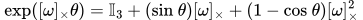

The initial condition constraints will be given by:

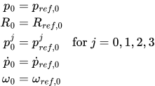

Note: we have no initial condition for the force $f^j_0$.

We mainly follow CasADi documentations [here](https://web.casadi.org/docs/#opti-stack) for implementing the optimization problem.
We define the optimization variables, constraints, and objective function using the `Opti` class in CasADi.
```python 
import casadi as ca
 opti = ca.Opti()
 X = opti.variable(18, N)
 U = opti.variable(24, N)
```
For any variables derived from the optimization variables `X` and `U`, you will be using CasADi type `ca.MX` to derive it symbolically. 
For example:
```python
# the objective
J = ca.MX(1, 1)
```

You will find three `TODO`s in the `traj_opt.py` file.
 - [ ] Implement the objective function
 - [ ] Implement the dynamics constraints
 - [ ] Implement the initial condition constraints

After implementing the optimization problem, you can run the optimization by running `python main.py --display --name squat`.
You can also save the videos using the `--save` flag.

## Exercise 2: Trotting motion (5%)
Great! Now you have implemented the optimization algorithm for the squatting motion. Let's move on to the trotting motion.

We have also provided you with a kinematic reference trajectory for the trotting motion in `generate_reference.py`. 
Please switch the `motion_type` to `trot` and run the script `python main.py --display --name trot` to generate and visualize the reference trajectory.
Without any modification to the optimization problem, you should be able to achieve a relatively okay trotting motion using the same optimization algorithm.

Do you notice any artifacts in the optimized trotting motion?
Even the optimized ground reaction force looks okay, the motion may not look natural because of the foot skating issue.

So your task is to improve the trotting motion by adding constraints to prevent foot skating!

We will implement the following contact constraints to prevent foot skating, for each leg $j$:

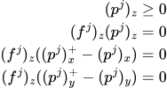

which basically means that the end-effector should not penetrate the ground, and the contact force should be zero if the end-effector is not in contact with the ground.
Also, when the end-effector is in contact with the ground, it should not move in the horizontal plane.

You will find the `TODO`s in the `traj_opt.py` file.
 - [ ] Implement the contact constraints

Once you have implemented the contact constraints, you can run the optimization by running `python main.py --display --name trot`. 
You will see that the optimized trotting motion looks more natural and the foot skating issue is resolved.

## Exercise 3: Walking motion with partial kinematic reference (5%)
In this exercise, you will implement the optimization algorithm to achieve a walking motion with partial kinematic reference.
With that being said, we will only provide the reference trajectory for the base and the end-effector of the front-left leg.

If you are not sure what a walking gait looks like, please watch this video [here](https://youtu.be/WrR3fVQ3W3s?si=vsYuOpQ6fjMlle8d).
In a short summary, the walking gait always have three legs in contact with the ground, and the robot moves forward by swinging the other leg in $1/4$ time of the total period.
The swing leg iterates in the order of hind-right, front-right, hind-left, front-left.

You can find the `TODO`s in the `generate_reference.py` file.
 - [ ] Implement the reference trajectory for the end-effector of the hind-right, front-right, and hind-left legs.

After generating the reference trajectory, you can run the optimization by running `python main.py --display --name walk`.
You will see that the optimized walking motion looks more natural and the robot moves forward by swinging the legs.

But...
Do you notice any artifacts in the optimized walking motion?

Right! It looks like the robot base is waving along the y-axis.
However, we have a robot with only 8 DOF, and the base should not move in the y-axis direction because of the missing abduction joint.
So your continued task is to improve the walking motion by adding constraints to keep the end-effector of each leg remain in the same y plane as the shoulder joint.

You will find the `TODO`s in the `traj_opt.py` file.
 - [ ] Implement the constraints to keep the end-effector in the same y plane as the shoulder joint

To implement the constraints, you will need to express the end-effector position in the shoulder joint frame $B^j$ (which is a coordinate frame translated from the robot base frame $B$).
You can use the helper function `mult_homog_point_ca` to transform a point from one frame to another, and `reverse_homog_ca` to reverse the homogeneous transformation matrix.
Once you have the end-effector position in the shoulder frame $_{B^j}p^j$ transformed from the end-effector position in the world frame $p^j$.

The constraints will be given by the following equation. For each leg $j$:

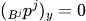

## Exercise 4: Jumping motion (5%)
Great! You have made it so far. Now let's move on to the jumping motion.

We have provided you with a kinematic reference trajectory for the jumping motion in `generate_reference.py`.
Please switch the `motion_type` to `jump` and run the script `python main.py --display --name jump` to generate and visualize the reference trajectory.

You will be noticing that the provided jumping reference trajectory is incorrect!
The robot legs are elongated during the jumping motion, which is not physically possible.
As a result the optimized trajectory will have similar issue.

So your task is to fix this issue by adding another kinematic constraint to prevent the legs from elongating during the jumping motion.

From the previous exercise, you should have already calculated the end-effector position in the shoulder frame $_{B^j}p^j$.
With these quantities, the constraint will be given by the following equation. For each leg $j$:


where $l_{thigh}$ and $l_{calf}$ are the lengths of the thigh and calf segments of the leg, respectively.

You will find the `TODO`s in the `traj_opt.py` file.
 - [ ] Implement the constraint to prevent the legs from elongating during the jumping motion

Once you have implemented the constraint, you can run the optimization by running `python main.py --display --name jump`.
You will see that the optimized jumping motion looks more natural and the robot legs are not elongated during the jumping motion.
However, you may notice that the robot is not actually jumping but rather staying on the ground for the whole motion.

We can now fix the source of the issue by modifying the kinematic reference trajectory.

You can find the `TODO`s in the `generate_reference.py` file.
 - [ ] Fix the reference trajectory for the jumping motion

After fixing the reference trajectory, you can run the optimization by running `python main.py --display --name jump`.
You will see that the optimized jumping motion looks more natural and the robot is actually jumping during the motion.

## Exercise 5: Bounding motion (5%)
Let's move on to the bounding motion.

We have provided you with a kinematic reference trajectory for the bounding motion in `generate_reference.py`.
Please switch the `motion_type` to `bound` and run the script `python main.py --display --name bound` to generate and visualize the reference trajectory.

The bounding motion will be similar to the trotting motion, but with more dynamic body movement.

However, there is still something that looks incorrect in the optimized bounding motion.
We have plotted the optimized contact force in the animation, and you will notice that sometimes there is a horizontal contact force even when the legs are in swing!

Let's fix this issue by adding a friction pyramid constraint to the contact force.

The friction pyramid constraint will be given by the following equation. For each leg $j$:

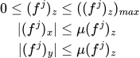

where $\mu$ is the friction coefficient.

You will find the `TODO`s in the `traj_opt.py` file.
 - [ ] Implement the friction pyramid constraints

Once you have implemented the constraint, you can run the optimization by running `python main.py --display --name bound`.
You will see that the optimized bounding motion looks more natural and the robot legs are not generating horizontal contact force when they are in swing.

## Exercise 6: 180-backflip motion with partial kinematic reference (10%)
Congratulations! You have done all the implementations of the trajectory optimization algorithm.
Now it will be a good time for us to play around it with some challenging motions.

Let's start with the 180-backflip motion.

We have provided you with a partial kinematic reference trajectory for the 180-backflip motion in `generate_reference.py`.
The core of the 180-backflip motion is to rotate the robot base by 180 degrees around the hind shoulder joint.
Following the base rotation, the front legs will be lifted and rotate around the moving front shoulder joint by 360 degrees.

We have already provided you with the reference trajectory for the base and you need to complete the reference trajectory for legs.

You can find the `TODO`s in the `generate_reference.py` file.
 - [ ] Implement the 180-backflip for the legs

After generating the reference trajectory, you can run the optimization by running `python main.py --display --name backflip180`.
You will see that the robot is actually doing a 180-backflip motion!

## Exercise 7: 360-backflip motion from scratch (15%)
Finally! In this exercise, you will implement the optimization algorithm to achieve a 360-backflip motion from scratch.

For the backflip motion, you may consider the following keyframes:
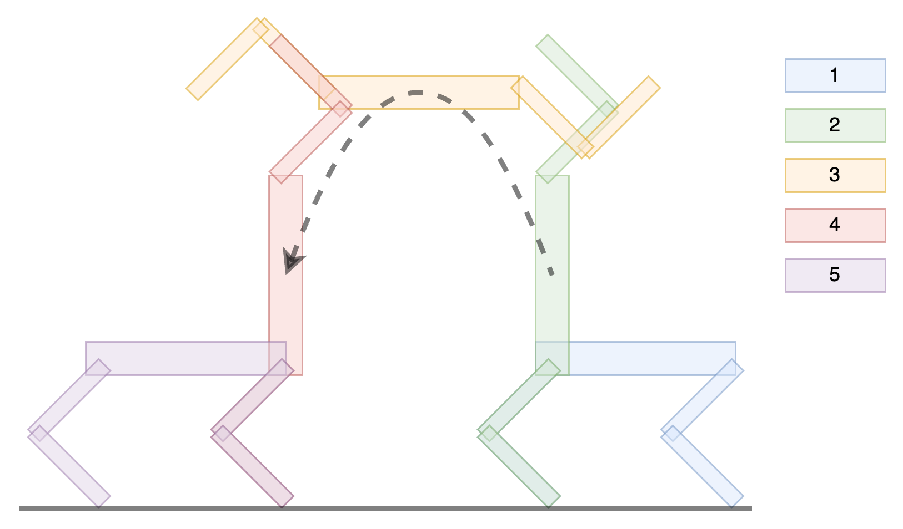
_Backflip motion keyframes_

We can start with the same 180-backflip motion but only execute 90 degrees of it. 
Then we design the base to rotate 180 degrees while performing a projectile motion (which is similar to the jumping motion).
Once the robot is touching the ground again, we then execute the second half of the 180-backflip motion to put the hind legs back to the ground.

You can find the `TODO`s in the `generate_reference.py` file.
- [ ] Implement the 360 backflip reference

Once you have done the implementation, please switch the `motion_type` to `backflip` and run the script `python main.py --display --name backflip` to generate and visualize the reference trajectory.

We have also provided you with helper functions such as `linear_interp_t` to linearly interpolate the keyframes.

## Exercise 8: Playback the motion in physics-based simulation (10%)
Congratulations! You have completed the trajectory optimization part of the assignment.
Now it is time to evaluate the optimized trajectories in a physics simulation environment.

In this exercise, you will enable the `--export` flag in the `main.py` script to export both the kinematic and the optimized trajectories into `csv` files.
We have already known how to calculate the end-effector position in the shoulder frame $_{B^j}p^j$. 
With these quantities, we can calculate the desired joint positions using trigonometric functions.
The detailed implementation can be found in `ik_np` from `utils.py`.
Since these functions are already implemented in the `utils.py` file, and we use it for visualization of the trajectories, we can directly use it to extract the desired joint positions.

Now you will be implementing the extracting process in `evaluation.py` by understanding the exported data from `export.py`.
After extracting the data, please reset the robot to the initial state and complete the `PLAYBACK` mode in the `evaluation.py` file.

Note: our simulation runs at 500 Hz, while our generated trajectories run at 50 Hz. We will be using zero-order hold to fill in the missing data.
We have a index variable `idx` to keep track of the current index of the frame in the generated trajectory. Please remember to increment the `idx` variable in your implementation.

You can find the `TODO`s in the `evaluation.py` file.
 - [ ] Extract the data from the csv file
 - [ ] Implement resetting function for the initial state
 - [ ] Implement the playback mode

Once you have the exported `csv` files, you can run the evaluation script by running `python evaluation.py --file <my-experiment-name>.csv --mode PLAYBACK`.
For completing this exercise, you only need to provide the playback videos for the motions you have managed to optimize.

## Exercise 9: Implement a simple PD controller (5%)

Now let's use the extracted desired joint positions to implement a simple PD controller to track the optimized trajectories in the physics simulation environment.

At each simulation step, we will calculate the desired joint torque using the PD controller, and apply the torque to the robot.
The PD controller is given by the following equation:

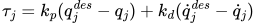

where $k_p$ and $k_d$ are the proportional and derivative gains, respectively.

You can find the `TODO`s in the `evaluation.py` file.
 - [ ] Implement the PD controller

You may need to tune the gains to achieve a stable tracking behavior for certain motions.

Spoiler: not all optimized trajectories can be tracked by a PD controller.

For completing this exercise, you need to provide the simulation videos for the motions you have managed to optimize.
In addition to this, please also provide a brief analysis of the behavior of the PD controller in the `behavior_analysis.md` file.
You can analyze the tracking error, the stability of the tracking, and the performance of the PD controller.

## Exercise 10: Implement a feed-forward torque controller (10%)
Remember that we have also optimized the contact forces in the trajectory optimization.
We can use these optimized contact forces to calculate the desired joint torque easily (under some assumptions) using the following formula.
For each limb:

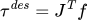

where $\tau^{des}$ is the desired joint torque, $J^T\in\text{R}^{2\times2}$ is the transpose of the Jacobian matrix, and $f$ is the optimized contact force for that limb.

Note: the Jacobian matrix $J$ is a $2\times2$ matrix that maps the joint velocities to the end-effector linear and angular velocities. 
It can be calculated analytically for our simple quadruped robot as the end-effector position remains in the same plane as the shoulder joint. 

In this exercise, you will need to implement the function `planar_jac_transpose_np` in `utils.py` to that will be called in `jac_transpose_np` to calculate the desired joint torque.

You may find the `TODO`s in the `utils.py` file.
 - [ ] Implement the `planar_jac_transpose_np` function

Similarly to getting the end-effector position in the shoulder frame $_{B^j}p^j$, we can also calculate the contact force in the shoulder frame $_{B^j}f^j$.
The desired joint torque should contribute to generate a contact force that is equal to the optimized contact force but in the opposite direction.

Hint: you may need to take a closer look of how we define the joint positions as the output of IK. 

Once you have implemented the function, you can rerun the main script to export the trajectories with feed-forward torque.
Then you can complete the code in `evaluation.py` to apply the feed-forward torque controller.
 - [ ] Implement the feed-forward torque controller

Then rerun the evaluation script by running `python evaluation.py --file <my-experiment-name>.csv --mode FF`.

For completing this exercise, you need to provide the simulation videos for the motions you have managed to optimize.
In addition to this, please also provide a brief analysis of the behavior of the feed-forward torque controller in the `behavior_analysis.md` file.
You can analyze the tracking error, the stability of the tracking, and the performance of the feed-forward torque controller.


## Exercise 11: Combine the feed-forward torque controller with a PD controller (5%)

Finally, let's combine the feed-forward torque controller with a PD controller to track the optimized trajectories in the physics simulation environment.

The combined controller is given by the following equation:

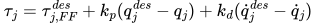

where $\tau^{des}_{j,FF}$ is the desired joint torque calculated from the feed-forward torque controller.

You can find the `TODO`s in the `evaluation.py` file.
 - [ ] Implement the combined controller

Then run the evaluation script by running `python evaluation.py --file <my-experiment-name>.csv --mode FF_PD`.

You may need to tune the gains to achieve a stable tracking behavior for certain motions.

For completing this exercise, you need to provide the simulation videos for the motions you have managed to optimize.
In addition to this, please also provide a brief analysis of the behavior of the combined controller in the `behavior_analysis.md` file.
You can analyze the tracking error, the stability of the tracking, and the performance of the combined controller.

# Final Remarks

Congratulations! You have completed the assignment!

We hope you have enjoyed the exercises and learned a lot from them.

You should have noticed that the optimization algorithm is a powerful tool to generate optimized trajectories that are more dynamically feasible for various kinematic motions.
However, the generated trajectories can not be easily transferred to the physics simulation environment, which means that it is also difficult to carry these motions directly on the real robot.

Note that we are still using a very simplified dynamics model in the optimization algorithm. 
Researchers have invented more complex dynamics model such as centroidal dynamics model, and even whole-body model for the trajectory optimization.
In addition, to allow the control actions to be adjusted in a feedback loop, model predictive control (MPC) is often used for the robot. 

If you are interested in learning more about the trajectory optimization and control for legged robots, we recommend reading the papers in the reference.

# Reference
[1] Winkler, Alexander W., et al. "Gait and trajectory optimization for legged systems through phase-based end-effector parameterization." IEEE Robotics and Automation Letters 3.3 (2018): 1560-1567.

[2] Ding, Yanran, Abhishek Pandala, and Hae-Won Park. "Real-time model predictive control for versatile dynamic motions in quadrupedal robots." 2019 International Conference on Robotics and Automation (ICRA). IEEE, 2019.

[3] Ding, Yanran, et al. "Representation-free model predictive control for dynamic motions in quadrupeds." IEEE Transactions on Robotics 37.4 (2021): 1154-1171.

[4] Tassa, Yuval, Tom Erez, and Emanuel Todorov. "Synthesis and stabilization of complex behaviors through online trajectory optimization." 2012 IEEE/RSJ International Conference on Intelligent Robots and Systems. IEEE, 2012.

[5] Kuindersma, Scott, et al. "Optimization-based locomotion planning, estimation, and control design for the atlas humanoid robot." Autonomous robots 40 (2016): 429-455.

[6] Di Carlo, Jared, et al. "Dynamic locomotion in the mit cheetah 3 through convex model-predictive control." 2018 IEEE/RSJ international conference on intelligent robots and systems (IROS). IEEE, 2018.

[7] Dai, Hongkai, Andrés Valenzuela, and Russ Tedrake. "Whole-body motion planning with centroidal dynamics and full kinematics." 2014 IEEE-RAS International Conference on Humanoid Robots. IEEE, 2014.

[8] Kalakrishnan, Mrinal, et al. "Learning, planning, and control for quadruped locomotion over challenging terrain." The International Journal of Robotics Research 30.2 (2011): 236-258.

# Troubleshooting
1. You may encounter the following warning when running `main.py`, please ignore it.
    ```bash
    DeprecationWarning: The distutils package is deprecated and slated for removal in Python 3.12. Use setuptools or check PEP 632 for potential alternatives
    ```

2. When setting the `--display` flag when running `main.py`, the animation window will be displayed. The process will pause, so you may need to close the animation window to continue the process.

3. You may encounter the following warning when running `evaluation.py`, please ignore it.
    ```bash
   2025-02-19 10:25:09.996 python[27375:25471232] +[IMKClient subclass]: chose IMKClient_Modern
   2025-02-19 10:25:09.996 python[27375:25471232] +[IMKInputSession subclass]: chose IMKInputSession_Modern
   ```
